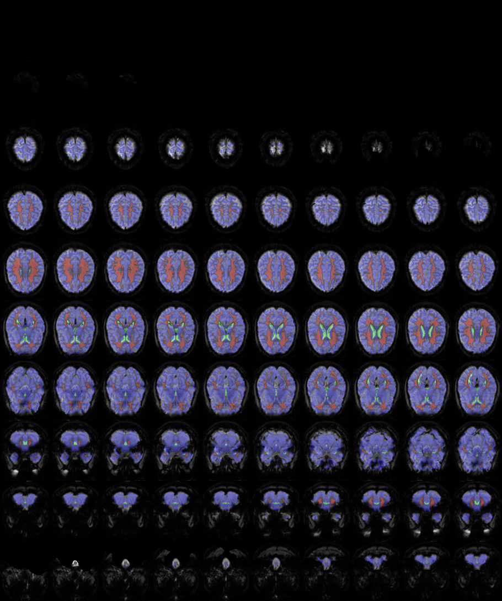

Nuisance signal regression
==========================

QuNex enables flexible estimation and removal of nuisance signal in fMRI data. 
This allows the user to:

(i) estimate the presence of nuisance signal in the brain, 
(ii) control for nuisance signal in task activation GLM analyses, and
(iii) remove nuisance signal as a preprocessing step in preparing data for functional connectivity analyses.

QuNex can handle several types of nuisance signal, which can be divided into three groups:

(i) motion correction parameters, 
(ii) nuisance signal extracted from BOLD time series, 
(iii) any externally recorded nuisance signal(s).  

We'll review how each type of spurious signal is prepared and regressed.


Regression of movement correction parameters
--------------------------------------------

Head movement during BOLD signal acquisition is an important source of nuisance signal that can mask 
or inflate the task-related BOLD response and cause spurious correlations in analyses of functional 
connectivity. Removal of signals related to movement correction parameters is a standard step in 
functional connectivity preprocessing and is sometimes also used in task activation analyses. 
QuNex provides specific functionality for motion correction parameter regression that include 
(a) movement parameter preparation and (b) specification of movement parameter regression in GLM modelling. 

Motion parameters are automatically processed and copied when data are imported from a minimal preprocessing 
pipeline into the QuNex folder structure. When data is processed using HCP minimal processing pipelines and 
imported into the QuNex folder structure using the 'map_hcp_data' command, the six motion parameters 
(translation in the x, y, and z directions and rotation about the X, Y, and Z axes) are copied to the 
`sessions/<session id>/images/functional/movement folder`. For each bold file, a 'bold[N]_mov.dat' text file 
is created with the following information:

```
#frame     dx(mm)     dy(mm)     dz(mm)     X(deg)     Y(deg)     Z(deg)
     1  -0.003906  -0.007090   0.013321   0.525369   0.722412   0.611740
     2  -0.004437  -0.006768   0.013317   0.523251   0.702507   0.632201
     3  -0.005018  -0.007351   0.013436   0.526239   0.684650   0.647907
     4  -0.003611  -0.007624   0.013978   0.518844   0.694919   0.785924
     5  -0.002795  -0.007855   0.013742   0.497878   0.653377   0.806707
...
```

The file specifies the translation and rotation of each frame relative to the previous frame 
(or a reference image in the case of the first frame).

This data is automatically associated with the corresponding fMRI image by the recorded number of the 
bold image in the file name. For example, `bold3_mov.data` stores the motion correction parameters 
for the third bold image as listed in the `batch.txt` file and as also named in the `functional` 
folder (e.g., `bold3.nii.gz`).

The motion correction parameters are then regressed during GLM modelling, implemented by 
`preprocess_bold` and `preprocess_conc` commands. The regression of the motion parameters is specified 
with the `--bold_nuisance` parameter. Specifically, QuNex supports the following options for motion 
regression, which can be specified in a comma-separated string:

* `m` – include the six motion corrected parameters in the regression,
* `m1d` – include the first derivative of the six motion corrected parameters in the regression,
* `mSq` – include the squared six motion corrected parameters in the regression,
* `m1dSq` – include the first derivative of the squared six motion corrected parameters in the regression.

The motion parameters are included in the GLM as indicated. Estimates for each of the specified 
regressors are available in the coefficient file, and their estimated contribution to the BOLD signal 
is removed from the residual time series.


Regression of nuisance signal extracted from BOLD timeseries
------------------------------------------------------------

The nuisance signal can be estimated and extracted from the BOLD time series itself. Three 
types of nuisance signal estimates are most commonly extracted and used: (a) ventricular signal (V),
 (b) white matter signal (WM), (c) whole brain signal (WB). The reasoning is as follows. 
 For the V and WM signal, we assume that the cerebrospinal fluid and white matter, respectively, 
 do not contain information about neuronal activity. Any changes in the BOLD signal observed in 
 this tissue therefore do not reflect neuronal activity, but rather random MR noise, motion artifacts, 
 and/or the effects of physiological changes unrelated to neuronal activity (WM). 

The rationale for removing the global signal is a little different. It assumes that although 
the activity of individual brain regions changes over time, the average activity throughout 
the brain remains relatively stable, so that any signal present throughout the brain should 
primarily represent a nonneuronal nuisance signal. This reasoning is still controversial. 
Research has shown that regression of the global signal can shift the mean of the signal and 
inflate the negative correlation between brain regions, and that the global signal itself 
may contain information of interest. Therefore, the decision whether or not to remove the 
global signal should be made by the researcher on an informed basis, taking into account 
the potential impact and the specific research question.

### Extraction of ventricle, white matter and whole brain signal

Similar to the motion correction parameters, QuNex provides specific functionality for extracting 
and regressing BOLD time series based nuisance signal. The extraction of BOLD nuisance signal is 
supported by the `extract_nuisance_signal` command. The `extract_nuisance_signal` command works 
with a `batch.txt` file to loop through all sessions and functional images and extract the nuisance 
signal from each one, taking into account any filtering of sessions and/or images specified by the user. 
The command always works with volume representations of functional images, because - compared to 
dense or parcelled CIFTI files - only these images contain the relevant information.

By default, `extract_nuisance_signal` performs the following steps: First, it loads the volume 
representation of a functional run (e.g., `bold3.nii.gz`) stored in the `sessions/<session id>/functional` 
folder. Second, it loads a BOLD brain mask specific to that functional image, located in the 
`sessions/<session id>/images/segmentation/boldmasks/` folder, e.g., `bold3_frame1_brain_mask.nii.gz`, 
and masks out all non-brain voxels so that they are not included in the signal extraction. 
Third, it loads the freesurfer brain segmentation image for that session, downsampled to functional 
image resolution, located in `sessions/<session id>/images/segmentation/freesurfer/mri/aparc+aseg_bold.nii.gz`. 
Based on the segmentation, three masks are defined: a ventricle mask (V) containing all voxels 
identified as any of the ventricles, a white matter mask (WM) containing all voxels identified as 
white matter, and a whole brain mask (WB) that contains all voxels identified as gray matter. 
After these masks are created, it erodes them by removing all voxels that share a surface 
(for V and WM masks) or more than nine edges (for WB mask) with voxels not included in the mask.
Then it computes and saves the mean signal across all the voxels in each of the masks.

The following files are saved when running `extract_nuisance_signal` command:

* `sessions/<session id>/images/functional/motion/bold[N].nuisance`  
  stores mean signal values across the nuisance ROI for each of the frames in the BOLD image
* `sessions/<session id>/images/ROI/nuisance/bold[N]_nuisance.nii.gz`  
  stores a volume image with the following frames:
  * frame 1: the first volume of the bold image
  * frame 2: the whole brain (WB) mask
  * frame 3: the ventricle (V) mask
  * frame 4: the white matter (WM) mask
  * frame 6: a combined mask with values 1–WB, 2—V, 3–WM
* `sessions/<session id>/images/ROI/nuisance//bold1_nuisance.png`  
  an image file with axial slices of the BOLD image of the brain with transparent ovelay indicating
  whole brain (blue), ventricle (green) and white matter (red) tissue as used for extracting the nuisance signal

An example `.nuisance` file is:

```
frame            V                WM               WB              
1                33320.7304687500 26928.9746093750 29940.0703125000
2                33382.0859375000 26915.7148437500 29923.3105468750
3                33334.6640625000 26930.1347656250 29930.4296875000
4                33267.6640625000 26920.2167968750 29926.7617187500
5                33280.3476562500 26907.8964843750 29906.0507812500
...
```

  
An example image file of V, WM and WB nuisance masks.


### Advance extraction of nuisance BOLD signal

The `extract_nuisance_signal` provides additional advanced functionality:

**Switching off the mask erosion**.   
Mask erosion is used to remove all boundary voxels between the three tissues of interest, 
since boundary voxels may contain a mixture of signals due to low resolution and spatial 
smoothing performed during minimal preprocessing. If desired, this erosion can be turned 
off by setting the `--shrinknsroi` parameter to false.

**Exclusion of brain areas from the whole brain mask**.   
A researcher may wish to exclude certain brain areas from the calculation of the whole 
brain signal. For example, if a researcher is interested in functional connectivity between 
a set of brain regions or in computing a seed map of functional connectivity with a 
particular region, they may wish to exclude that region(s) from the calculation of the 
global signal. This is enabled by the `--wbmask` parameter, which can be either a `.names`
ROI definition file or a binary mask that identifies all voxels that should not be included 
in the whole brain nuisance signal mask.

**Inclusion of additional regions for the nuisance signal extraction**.   
At times, a researcher may wish to extract nuisance signals from one or more additional 
regions inside or outside the brain. This can be accomplished with the parameter `--nroi`. 
The parameter can specify either a binary mask file or a `.names` ROI definition file. 
In the latter case, the regions to be included must also be specified as a comma-separated 
list following the path to the `.names` file, with the two pieces of information separated 
by a pipe `<path to the .names file>|<roi 1>,<roi 2>,<roi 3>`. 
A concrete example could be `<path>/nuisance_roi.names|eyes,scull`. The `.names` file can 
refer to subject-specific masks, which must then be specified with the `--sessionroi` 
parameter. The parameter currently accepts 'wb' or 'aseg' as valid values referring to 
the bold whole-brain mask in `sessions/<session id>/images/segmentation/boldmasks/bold[N]_frame1_brain_mask.nii.gz` 
or the freesurfer segmentation in `sessions/<session id>/images/segmentation/freesurfer/mri/aparc+aseg_bold.nii.gz`, 
respectively.

Any additional extracted signal will be added as another named column in the generated `.nuisance` file.

### Regression of BOLD nuisance signal

The extracted BOLD nuisance signal is regressed in the GLM step implemented in `preprocess_bold` 
and `preprocess_conc` commands similar to the motion correction parameters. To remove an extracted 
nuisance signal, specify it with the `--bold_nuisance` parameter. Any signal present in the 
`.nuisance` file can be added to the comma-separated list. E.g. `--bold_nuisance="V, WM,WB,eyes,scull`. 
If 'n1d' or '1d' is added to the list, the first derivative of all BOLD nuisance signals or all 
specified nuisance signals (including motion correction parameters) will also be added to the 
GLM regression.

Regression of additional signals
--------------------------------

In addition to the motion correction parameters and the nuisance signals extracted from the 
BOLD images, any other signal can be added to the nuisance signal regression. These can include 
various physiological measures, such as blood oxygen levels, heart rate, respiration, pupil size, 
EEG alpha power, and any other signals of potential interest, such as eye movements, external 
motion parameters, and others. QuNex does not natively provide functions to process and add these 
signals, but they can be added as additional columns to the `.nuisance` files manually or using 
custom scripts. Any column in the `.nuisance` files can then be referenced with the `--bold_nuisance` 
parameter, just like previously described motion correction parameters and BOLD nuisance signals.

The functionality described allows control, removal or estimation of any continuous signal in 
the GLM modeling step. For more information and details, please consult the following additional sources:

* inline help for `extract_nuisance_signal`, `preprocess_bold` and `preprocess_conc` QuNex commands
* inline help for `general_extract_nuisance`, `fc_preprocess_bold` and `fc_preprocess_conc` matlab functions
* file specification for `.names` ROI definition files


---
Written by Grega Repovš  
Last update: 2022-07-08  
QuNex version: 0.93.8